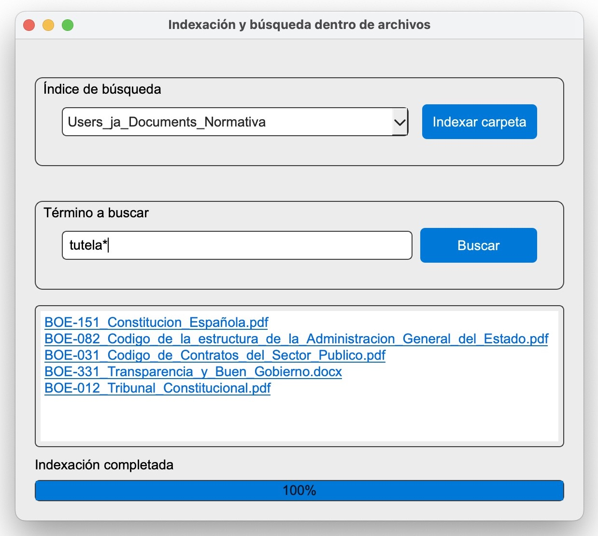

# Indexador y Buscador de Documentos

Este proyecto es una aplicación gráfica multiplataforma para indexar y buscar contenido en archivos de texto con
extensión `.docx`, `.pdf`, `.txt` y `.md`. Utiliza **PyQt5** para la interfaz gráfica y **Whoosh** para el motor 
de indexación y búsqueda.

## Características

- **Indexación de carpetas:** Indexa todos los documentos que haya en el árbol de carpetas que se seleccione.
- **Reindexación inteligente:** Sólo procesa los cambios en caso de reindexar una carpeta ya existente. 
- **Búsqueda inmediata:** Utiliza el índice para las búsquedas y devuelve enlaces directos a los documentos.
- **Interfaz multiplataforma:** Probado en MacOS y en Windows.



## Requisitos

- Python 3.8 o superior
- Librerías necesarias:
  - `PyQt5`
  - `Whoosh`
  - `python-docx`
  - `pypdf`

Se instalan ejecutando:
```bash
pip install -r requirements.txt
```

## Uso

1. **Indexación:**
   - Hacer clic en "Indexar carpeta" para seleccionar una carpeta que contiene documentos.
   - Los archivos serán procesados e indexados automáticamente.
   - Si la carpeta ya está indexada sólo se reindexarán los cambios, tanto de contenido como de localización.

2. **Búsqueda:**
   - Teclear el término a buscar (acepta caracteres comodín) y pulsar en "Buscar".
   - Los resultados aparecerán con enlaces directos para abrir los documentos.


## Estructura del proyecto

- `main.py`: Punto de entrada principal.
- `indexingthread.py`: Lógica de indexación y búsqueda.
- `gui.py`: Implementación de la interfaz gráfica.
- `gui_config.py`: Constantes de configuración del programa.
- `textextractor.py`: Extracción de texto desde diferentes formatos de archivo.
- `filehashing.py`: Cálculo de hashes para detectar cambios en el contenido o localización de ficheros
- `logger.py`: Módulo para la gestión de logs por terminal y en fichero

## Contribuciones

Se agradecen las contribuciones mediante fork del repositorio y solicitudes de pull request.

## Licencia

Este proyecto utiliza la Licencia MIT. Consulte el archivo `LICENSE` para más información.

